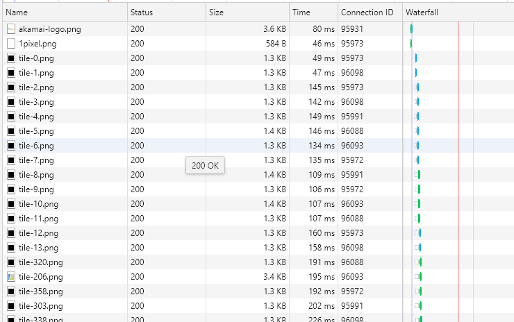

# 前端性能优化

性能优化一直是老生常谈的问题，平时我们可能用到的都是非常琐碎的知识来优化。

这节会具体的谈到每一方面。

## 从一道题目开始

**从浏览器输入url到页面展示具体发生了什么?**

非常耳熟的一道题目，不过仔细一想，其实它要考察的东西还真不少，比如DNS查询 TCP连接 http请求 浏览器渲染等等。

这里我们不讨论非常底层的网络传输协议，仅对我们比较常见的知识点就行解析。

那我们回答以下这道题目。

浏览器输入url到页面展示发生了:

- DNS查询：将输入的域名转换成IP地址
- TCP连接：一个网络请求过程必定会经历三次握手四次挥手的过程
- HTTP请求: 浏览器将请求内容传输给服务器，服务器将响应内容发送给浏览器
- 浏览器渲染：浏览器将服务器返回的html解析成一个个像素点展示在电脑上。

上面的每一步其实又可以分为很多内容。比如:

DNS查询：DNS的查询策略是什么? 

TCP连接：如何减少TCP挥手带来的损耗? 

HTTP请求: 是不是考虑压缩请求内容，是不是对多个资源进行合并来减少请求数量? 

浏览器渲染: 浏览器是如何渲染的呢? css js阻塞是怎么一回事? 为什么DOM操作非常费性能? 重绘 重排是怎么一回事? 

上面已经提出了很多的疑问? 其实这也是本节内容要写的内容。所以篇幅会比较长。

## 如何优化DNS查询:

### DNS查询:

首先我们说以下DNS查询策略：

我们都知道DNS查询的作用是: 将域名转换成ip

这里有些人就说了: 那我们直接用ip访问不就好了吗? 跳过了DNS查询过程。

话糙理不糙，确实是这样的。

那为什么没有广泛使用呢?

首先是ip都是数字，记不住，第二，现在web应用比较庞大，有时一台服务器无法满足，所以有很多服务器在同时运行，这里就需要有一个概念了"负载均衡""反向代理"，因为我们无法得知真正为我们提供服务的是哪个服务器，所以直接访问ip比较少。

上面扯了半天废话，下面来说下查询策略:(以查询www.xxx.com为例)

1. 从浏览器缓存寻找，浏览器会定期缓存DNS记录(chrome下使用chrome://net-internals/#dns查看)

2. 如果浏览器缓存中没有找到，从操作系统缓存种需按照(windows下cmd下可使用 ipconfig /displaydns 命令查看)

3. 如果操作系统缓存中没有找到，在路由器缓存中寻找(路由器也可以缓存)

4. 如果未找到，寻找本地hosts文件(windows C:\WINDOWS\system32\drivers\etc\hosts，本地hosts文件可以配置ip和域名的对应关系，所以如果本机的hosts配置了这个映射关系，就会使用hosts里的ip地址
)

    比如hosts文件修改为：
    ```
        www.xxx.com 127.0.0.1
    ```
    
    如果本地启动了一个127.0.0.1 80端口的服务，访问www.xxx.com则页面会返回本地服务配置的页面信息

5. 如果还未找到，向运营商查询。运营商一般都有DNS服务器来应对DNS请求，而且运营商也会缓存这个映射记录。所以，首先向运营商的缓存查询。
6. 如果运营商的缓存中未找到，则运营商的DNS服务器就会工作,向域服务器查询，首先会向根域服务器查询(.是根域服务器)，如果没有查找到，向.com域服务器查询，如果还未查到，向xxx.com域服务器查询，如果还未找到，向www.xxx.com查询，查到就停止。

    > 这里有个小知识点:域名是从右向左解析的，可不是按照我们书写解析的！

上面我们大概了说了以下域名的查找策略，其实DNS查找比较复杂，这里我们只要知道它是这么查找就够了。

前端优化DNS方式主要是dns-prefetch(DNS预查询)

```
<meta http-equiv="x-dns-prefetch-control" content="on">

<link rel="dns-prefetch" href="http://www.xxx.com">

```
通过预查询会加快DNS查找速度。

### CDN加速

什么是CDN?

比如我的服务器在北京，那国外的人访问服务器的时候，就会非常慢，因为距离非常远，这和我们平时访问一些英文网站一样，距离远必然会慢。 那我再国外又部署了几台服务器，那国外的人访问服务器会访问到国外的那几台服务器，距离近了，速度自然就快了。

所以其实cdn就是会根据用户ip地址 cdn服务器繁忙程度来动态分配一个最佳的访问线路。

这里我们不谈CDN的工作原理,因为笔者也没搞清楚。

cdn的应用:

cdn适合放置静态资源，比如js css video img 等等。

cdn的核心有两个："缓存" 和 "回源"

缓存： 资源copy到cdn服务器的过程。

回源: cdn服务器发现自己没有这个资源时(一般是缓存数据过期)，转头向根服务器（或者它的上层服务器）去要这个资源的过程。

cdn的好处:

- 我们知道cdn服务器的域名一般是和我们业务服务器的域名是不同的。所以可以避免访问静态资源携带cookie问题。

- 加快访问静态资源


## TCP如何优化

我们知道TCP会有握手挥手的消耗问题。(具体TCP三次握手四次挥手会写一片单独的文章)

那如何改善这个问题呢?

在http1.0时代，当一个http请求结束就会关闭当前连接，这就造成了TCP连接的浪费。

所以在http1.1时代，http默认会携带Connection: keep-alive, 主要是为了保持这个通信通道，并且复用。

比如请求完一个文件后，保持通道，下一个请求依然在这通道上通信。

在http1.1中还增加了pipelining,那什么是pipelining?

> pipelining: 就是支持多个请求同时进行，但是返回顺序依然按照请求顺序依次返回

这就是"线头阻塞"

虽然说，保证了请求可以同时进行，但是返回顺序按照请求顺序依次返回。

但是注意: 这个功能默认在浏览器内是关闭的。

在http1.1中，单个 TCP 连接在同一时刻只能处理一个请求。(不开启pipelining情况下)

所以一般而言，**浏览器都是开启多个TCP通道来支持http请求的。**

那是不是浏览器对于同一个域名支持开启的TCP数量是不限的呢？(这里说的是同时，也就是浏览器同时开启的TCP数量)

不是，chrome是6个，其他浏览器(包含手机浏览器)最大并发数也就6-10个。

说了这么多，那我们到底如何优化?

**使用http2优化**

上面我们说了很多http1.1的问题(虽然在http1.0基础上优化很大)，比如线头阻塞 http头信息重复(其实我们发现我们每次请求头信息基本有很多相同的)

这里我们只提到http2的一点点特性: 头部压缩 多路复用

其实http2还有很多特性，因为内容偏多，这里就不展开说了。以后会有单独的一片http2的文章。

- 多路并用：支持一个TCP通道多个http请求同时请求，不会像pipelining一样，返回顺序由文件大小决定。大文件自然相对慢一点，但是不会受到请求顺序的影响。

- 头部压缩: 就是字面意思，压缩http头信息

下面有个网站https://http2.akamai.com/demo,可以感受以下http和http2的区别。

这是chrome下对上面网站的请求情况：

http请求： 



上面我们发现上面有个ConnectionID，其实我们可以近似认为每个ConnectionID就是一个TCP连接。

为了证明上面提到的"同一个TCP通道http请求顺序执行"的结论，大家可以点以下"ConnectionID",这是用于排序的.


鼠标移动到Waterfall那一列，指向一个img资源，可以看到它的排队时间和开始时间。

那http2是如何请求的呢?


鼠标移动到Waterfall那一列，指向任意一个img资源，可以看到开始时间都是相同的，返回也是不受限制的。

http2在国内还是应用比较少，如果有机会，可尝试来用http2。

## HTTP请求优化

### 基础篇：

老生常谈的一些优化了，比如

- 减少http请求数量
- 减少http传输文件大小

在上面TCP优化一节中，我们了解到浏览器对于一个域名同时可开启的TCP通道是6条。

这6条TCP通道可以同时进行http请求，那这个是不是与我们说的"减少http请求数量"冲突了?

可能我们会认为http请求数量少了，也就无法利用到多条TCP通道带来的好处了。

其实这里说的"减少http请求数量"不是要把文件都合成一个文件这样的，是相对减少HTTP请求数量，TCP通道依然可以利用。

比如Vue项目：

一般而言，我们会将公共库文件打包成一个库文件，将业务代码另行打包。 并不是说打成一个包就行了。

这里说的减少http请求数量不是要把这个数量减成1 ！！！

只是我们可能把那些冗余的请求合并起来，所以这里不要误解了。

减少http请求数量的使用场景:

- 雪碧图: 对于特别小的图标，每次发一次请求确实非常浪费，这里就可以把这些小文件理解成冗余请求。雪碧图就是把多张小图标合成到一张大图上。

- 小图标：对于非常晓小的icon问题，可使用base64来填充。webpack中file-loader有相关配置。

- 公共库可以合并

对于http请求数量问题，我们知道记住: 不是http数量越少越好，我们需要从浏览器TCP通道 用户体验等多方面考量。但是对于我们说的场景，可以用于生产环境。


减少http传输文件大小:

这个很好理解，比如代码压缩啊等常见优化。比如将静态资源放置cdn，header头信息减少等等。

### gzip压缩
以前刚入行的时候，看到雅虎的性能优化方案中有一项: **gzip压缩**

现在终于可以粗略的写出什么才是gzip压缩了。

> gzip的原理: 在一个文本文件中找出一些重复出现的字符串，临时替换它们，使文件变小。

所以，文件中重复字符越多，压缩率越高，使用Gzip的效果也最好。

#### gzip真的是万能的?

压缩操作基本都在后端，需要时间，浏览器解压文件也需要时间。

提出疑问： Gzip真的提升了访问速度吗?

毫无疑问的，当然如果你文件大小非常小，几k，几十k，说实话不太建议使用Gzip。

但是对于大型项目，以Vue为例，我们知道，Vue项目最后打包文件非常大，动辄上M。这种情况下，压缩和解压缩的时间在请求时间面前就显得微不足道了。

真实的案例：

**Gzip的使用使js css文件大小缩小了近2/3。**

非常恐怖的压缩率，但是发现: 图片文件并没有多大的改观。

其实想想也是，图片文件色彩多变，内部包含了很多不同像素点，压缩率自己会很低。

如果有兴趣，可以试试颜色单调的图片和色彩比较多的图片的Gzip。

#### 代码层面如何设置Gzip呢?

上面说了很多，基本都是说Gzip带来的好处，那我们如何配置Gzip呢?

我们会以nginx和Node分别说明：

**Nginx配置Gzip:**

```
    Gzip  on;

```
开启很简单，当然nginx还有很多Gzip配置的属性，这里就不展开讲了。

**Node配置Gzip:**

以一个基础代码讲起：

```
const http = require('http');
const zlib = require('zlib');
const fs = require('fs');
let compress = ''
const file = './html/index.html'
let server = http.createServer((req, res)=>{
    // 这里是重点： 只有请求头里面包含accept-encoding(代表浏览器支持的压缩方式),后端才可以对其压缩
    let acceptEncoding = req.headers['accept-encoding'];
    let gzip = zlib.createGzip();
    if(acceptEncoding.indexOf('gzip') != -1){
        compress = zlib.createGzip();
        // Accept-Encoding: gzip, deflate: 默认是这两种压缩方式。本文为了说明问题，仅仅做了Gzip的方式，其实Gzip的核心算法依然是deflate
        // 后端需写一个响应头'Content-Encoding': 'gzip'
        res.writeHead(200, {
            'Content-Encoding': 'gzip'
        })
        // 管道流
        fs.createReadStream(file).pipe(compress).pipe(res);
    }else{
        fs.createReadStream(file).pipe(res);
    }
})

server.listen(3000)

````
上面就是通过Node实现的Gzip。

它的核心就是: 

- 判断请求头是否有accept-encoding

- 如果有，选择一种方式压缩，并且需要写响应头'Content-Encoding': 'gzip'(这里也可能是deflate)

- 使用管道流，压缩完毕以后传到浏览器。

所以以后我们查看这个文件是否经过了Gzip压缩，只要看这个文件的响应头里是否有'Content-Encoding': 'gzip'，如果有，则说明经历了Gzip压缩。

#### webpack中Gzip是怎么一回事?

写Vue项目的时候，我们知道webpack可以将文件压缩成.gz文件。.gz文件就是文件Gzip后的后缀名。

我们知道服务器压缩文件的时候其实是需要时间的，需要cpu的工作。

而webpack的Gzip功能就是为了减轻服务器的压力，把本该服务器压缩这个文件的活给自己干了。

比如webpack中最后打包生成了一个.gz文件，那服务器则无需再去压缩，直接返回即可。

在上面Node代码上修改:

```
const http = require('http');
const zlib = require('zlib');
const fs = require('fs');

const file = './html/index.html.gz'
let server = http.createServer((req, res)=>{
     compress = zlib.createGzip();
        // Accept-Encoding: gzip, deflate: 默认是这两种压缩方式。本文为了说明问题，仅仅做了Gzip的方式，其实Gzip的核心算法依然是deflate
        // 后端需写一个响应头'Content-Encoding': 'gzip'
        res.writeHead(200, {
            'Content-Encoding': 'gzip'
        })
        // 管道流
        fs.createReadStream(file).pipe(res);
    }else{
        fs.createReadStream(file).pipe(res);
    }
})


server.listen(3000)
```

这两者都相辅相成的，如果你考虑使用Gzip，那么你应该想到webpack Gzip这个概念。

上面就是常见HTTP的优化，http缓存我们就在后面独立讲到，这里只说对http请求数量 http内容的优化。  

但是请不要忘记http2的特性。这里可以想以下上面提到的http2的作用。


## 浏览器渲染

到了我们前端非常熟悉的领域了，毕竟什么回流 重绘 css树都略有耳闻不是。

这个系列内容会非常多，我们会讨论到浏览器如何渲染页面，会讨论到缓存问题，会讨论到图片的优化， 以及已经成为业界共识的一些js方法。

### 如何渲染一个页面?


