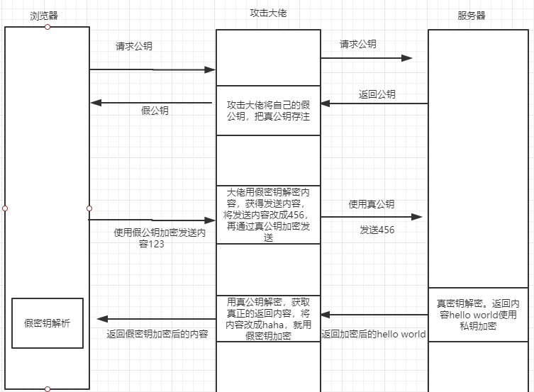

# https工作原理

平时我们经常说https安全，一旦说起http被劫持数据传输不安全问题，就直接上https。

但是https的工作原理是什么? 它为什么安全? 不用https行不行?

带着上面的疑问，我们下面具体解答一下。

## 不用https行不行?

我们知道http传递都是明文传递，直接传输肯定是不行的，数据全部都暴露了。

那要不我们加密一下?

### 1. 对称加密

对数据进行对称加密。

比如浏览器请求一个域名 ( `http://www.xxx.com/api/post/` ),请求数据通过了"某个密钥"进行了对称加密，服务端接收到请求，再使用"这个密钥"解密。

一般情况下，这种方式确实能保证一些安全。但是对于"攻击大佬"来说，没用!

想一下，我们上面说的"某个密钥"是从哪儿来的?

肯定是从服务端传过来，那这个传递"密钥"过程，攻击大佬直接取到你的密钥就完事了。

所以说，在"大佬"面前，对称加密和明文传递没啥区别。

out!!!

### 2. 非对称加密

既然对称加密不行，那我们用非对称加密怎么样?

浏览器再次请求上面的域名(http://www.xxx.com/api/post/),请求数据通过了"公钥"进行了加密，服务端接收到请求，使用"私钥"解密。

那这个"公钥"怎么来的?

还是从服务端传过来，不过这"公钥"没啥用，本来就是让全世界知道的。(非对称加密公钥加密，私钥解密)就算攻击大佬取到了你公钥加密后的数据，没"私钥"解密也没啥用。

咦，那是不是我们使用非对称加密就好了，用啥的https。

访问了半天发现： 访问这么慢，(非对称加密速度很慢)这不行啊，平时我1s就能访问到网站，现在得5s

非对称加密的缺点：

    1. 速度缓慢

还有一个问题:

浏览器能确定给你发消息是我们正确的服务器?

下面就是中间攻击方做的一个攻击处理

还是不行啊，无法解决中间方攻击和加密缓慢的问题。

### https是如何工作的?

上面有两个问题:中间方攻击和加密缓慢

中间方攻击说白了就是我们不能信任服务器发送的公钥。

加密缓慢说白了就是我们不能一直使用非对称加密加密。

这其实也就是https要解决的问题

#### 如何解决不信任公钥问题?

这里就需要引入一个概念：**数字证书**

数字证书 = 网站信息 + 数字签名

网站信息我还能稍微理解一点,可能指的是网站域名啊这些信息。

数字签名是个啥呢?

还是先说一下网站信息吧，这个容易理解。

其实网站信息主要包含网站域名 网站公钥(也就是上面我们说的那个被中间方获取的那个)，hash计算方式

比如我们网站信息是: 

域名:www.xxx.com 
公钥:xxxx 
hash计算方式: md5(内部可能用的不是md5，仅作参考)

下面我们说数字签名：

数字签名 = (网站域名+公钥+其他信息)进行hash计算，获得一个消息摘要，然后使用第三方认证机构私钥加密生成。

这样就可以了吗?

举例:

我们访问域名(https://www.xxx.com),服务器首先会把数字证书发送我们，如果此时中间方将这个证书修改了怎么办? (证书包含了数字签名和网站信息，包含公钥)

好像绕到了死循环，这个服务器返回的公钥永远不可靠。

那怎么办呢?

到了这里就得靠我们浏览器了，一般而言，我们浏览器保存了大部分权威CA机构的公钥。

这里它们的验证方案是这样的：

我们知道数字签名是通过CA的私钥加密的，那我们用浏览器的知道的这个CA的公钥解密，获取到一个消息摘要。

然后我们使用
hash计算方式(网站域名+公钥+其他信息)获得一个消息摘要。

如果这两个消息摘要相同，则说明证书有效，公钥也可以安全获取。

这里我们终于解决了公钥安全问题。

#### 如何解决非对称加密加密缓慢问题

其实https并不是每次都使用非对称加密加密的。

那它是如何工作的?

https获取到服务端的公钥，此时浏览器生成随机对称密钥，并使用服务端公钥加密，服务端通过私钥解密,发送一个完成的消息，客户端验证成功后，说明ssl通信通道已经建好。

然后数据就可以通过上面提到了随机对称密钥对称加密数据进行通信。

其实这也就是https的工作原理，非对称加密负责搭建ssl通道建立，对称加密负责数据传输，这也就解决了都用非对称加密缓慢的问题。

### 总结:

https工作原理:

1. 浏览器发送https请求
2. 服务端返回数字证书
3. 浏览器hash加密数字证书里的网站信息，浏览器使用CA公钥解密数字签名，比较这两者是否相同，如果相同，请求成功，否则，证书失效。
4. 浏览器随机生成对称密钥,使用服务端的公钥加密
5. 服务器私钥解密，发送消息
6. 客户端验证是否建立成功，成功，则说明ssl通道建立，否则通道建立失败。
7. 使用上面浏览器生成的对称密钥对称加密进行数据传输。

