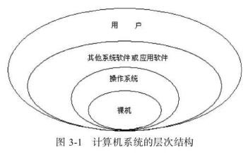

# 操作系统入门

本文都是理论知识，不会过深的讲解操作系统是如何运行的。只会简单的讲一些基础知识作为入门。

## 操作系统的认识

提起操作系统，我们第一印象可能就是windows linux等我们常用的操作系统。它的作用主要是运行某个程序 增删改查文件(夹) 等等。

说起计算机，它其实由硬件(cpu 内存 磁盘 鼠标 键盘 显示器) 软件(用户下载的程序，比如微信 qq qq音乐等等) 操作系统组成。

操作系统在中间的作用主要是管理软件，为这些软件分配硬件资源，提高用户使用计算机的方便性。

见

计算机最终是提供给用户使用的。用户可能无法理解cpu 内存，各种调度方案，所以操作系统要做的就是尽可能的简化用户的操作，将那些复杂的调度方案彻底隐藏起来。用户都是通过操作系统来使用计算机的。

## 操作系统的功能：

上面我们只是简单的提到了操作的系统的功能，下面我们从更加专业的方式来说明操作系统对cpu如何调度 内存如何调度等等知识。

### 1.系统资源管理

计算机的系统资源分为硬件资源和软件资源，硬件资源就是上面我们提到的cpu 内存 磁盘等，软件资源是存放在计算机系统中的文件 数据  程序等等。

操作系统的硬件管理分为cpu管理 存储管理 设备管理

#### cpu管理

cpu管理的主要作用是 合理有效的使用cpu资源，提高计算机使用效率。

cpu管理主要涉及进程和cpu算法调度开始讲解：

##### 进程

进程是一个程序在一个数据集上的一次执行过程，是动态的。

比如：我们打开word文档，就是开启了一个进程。打开qq，也是开启了一个进程。 
再比如打开chrome浏览器去打开n个tab页，这些都属于开启了一个进程。

但是需要注意的是：chrome中打开n个tab页，其实就是开启了n个进程。我们打开了n个word文档，也属于开启了n个进程。

所以，不要认为： 一个程序就代表了一个进程。因为进程是动态的，一个程序可能对应多个进程。如果关闭了程序，这个进程也就关闭了。

我们学习编程语言，总会遇到"多线程"的概念。

一个进程包含了多个线程。

一定要误解了进程和线程。

那进程是如何开启的呢?

操作系统创建进程时，必须要为该进程准备cpu资源 内存资源。如果资源不足，进程无法创建。在程序执行过程中，进程的资源状态随之变化。当执行完毕以后，进程关闭，资源回收。

